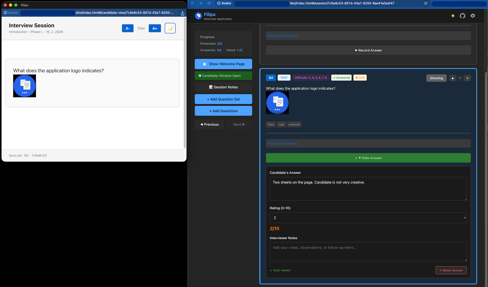

<div align="center">
  

# Filipa

**Assessment tool for technical candidate interviews**

[](LICENSE)
[](https://svelte.dev)
[](https://www.jetbrains.com/webstorm/)
[](https://claude.ai/code)
[](https://github.com/m0jimo/filipa)
</div>

## Application Preview



## Features

Filipa is designed for conducting interviews with job candidates. The application provides

- **Dual-view interface**: Separate synchronized views for the interviewer and the candidate
- **Question management**: Load and manage interview question sets with expected answers
- **Real-time assessment**: Take notes and rate candidate responses during the interview
- **Markdown-based**: Questions and answers stored in portable markdown or JSON files
- **Offline-capable**: Works without an internet connection, just open `index.html`
- **Import/Export**: Questions, candidates, or individual sessions can be shared with colleagues

I was looking for a simple way to present questions to candidates during an interview. I am a big fan of the markdown
format because it is easily readable in raw form and can also be simply converted to HTML with custom styles.

The main idea was to keep questions, candidate answers, and notes in a single file without needing a server or other
complex infrastructure, which would be problematic to run in highly controlled environments.

I ended up with the following workflow:

### Questions Catalog and Sets

- Questions can be created inside the application.
- Questions can be imported from JSON or markdown files.
- A `config.json` file placed next to `index.html` defines the mapping for importing from `.md` files.
- Duplicate question detection is included.
- Sets are groups of questions used for faster assignment to Interview Session.

### Candidates

- Multiple candidates with multiple sessions are supported.
- Each session can represent a different question area. For example, one interviewer can cover backend questions and
  another can cover frontend.
- Each session keeps a copy of the questions selected from the catalog.
- Candidate sessions can be exported or imported, allowing data from two separate Filipa instances to be combined.
- Questions can be added to the current session on the fly.

### Technical Details

- Hash-based routing allows the app to be opened directly in a browser from a local file without running a server.
- IndexedDB is used for sufficient storage space.
- A backup feature keeps all data in one place.
- The Candidate View can be opened in a separate browser window and questions can be shown from your Session page as
  needed.

### Development Background

I had this kind of application in mind for a long time, but never had enough spare time to realize it.
Thanks to AI, I was able to create a first functional version I was happy with, in just 8 hours.
You can also read my [developer notes](docs/application-dev-notes.md) for this project.

I use React at work, but I chose Svelte here to keep the built application small and to step outside the React world for
a while. But in reality, every single function in this project was written by AI, not me.

## Getting Started

**Try it online**: [https://m0jimo.github.io/filipa/](https://m0jimo.github.io/filipa/)

Or **[download filipa.zip](https://github.com/m0jimo/filipa/releases/download/latest/filipa.zip)**, extract it, and open
`index.html` in your browser.

## About the Name

*Filipa* comes from a Czech phrase "mit filipa" which is an idiom used to describe somebody who is smart, sharp or with
good
practical sense. Filip/Filipa is also first name for male/female.

# Application Development

## Prerequisites

- Node.js (v22 or newer recommended)
- npm, pnpm, or yarn

### 1. Install Dependencies

```bash
npm install
```

### 2. Development Mode

```bash
npm run dev
```

This will start the development server at `http://localhost:5173`.

### 3. Build for Production

```bash
npm run build
```

This creates a `dist/` folder with all compiled files.

## Using the Built Application

After running `npm run build`, you can:

### Option 1: Open Directly in Browser

1. Navigate to the `dist/` folder
2. Double-click `index.html` or open it via File > Open in your browser
3. The app works completely offline using the `file://` protocol

### Option 2: Deploy to a Web Server

- Upload the entire `dist/` folder to any static hosting service
- Compatible with GitHub Pages, Netlify, Vercel, AWS S3, and others

### Option 3: Share as a Zip File

- Zip the `dist/` folder
- Send it to users who can extract and open `index.html` locally
- Ideal for regulated environments where internet access is restricted

## License

MIT (c) [Ota Vaclavik](https://github.com/m0jimo) — see [LICENSE](LICENSE) for details.
